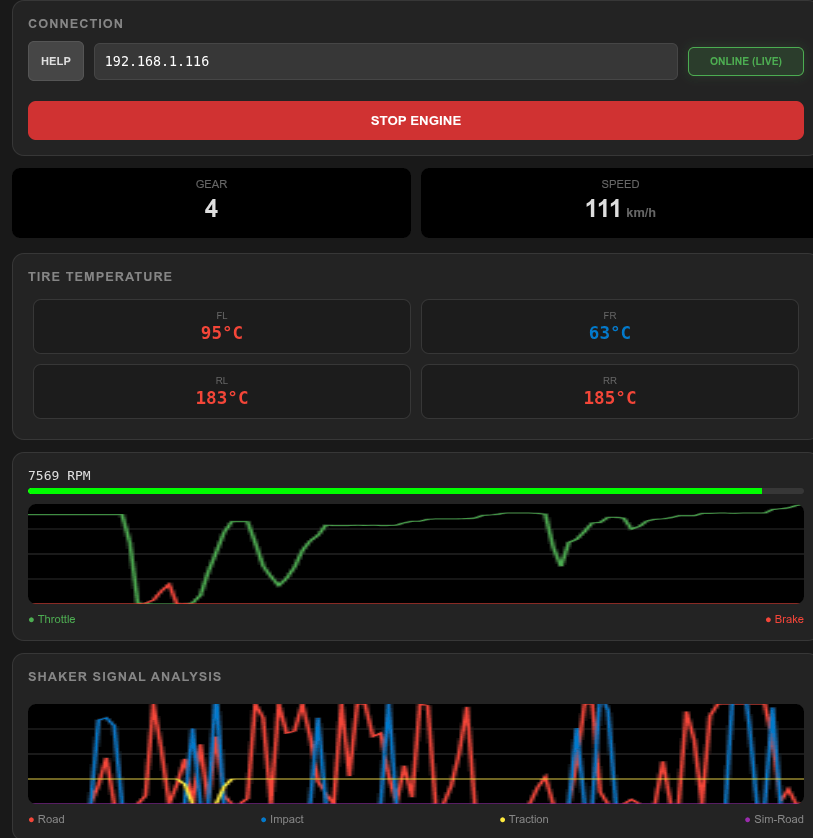
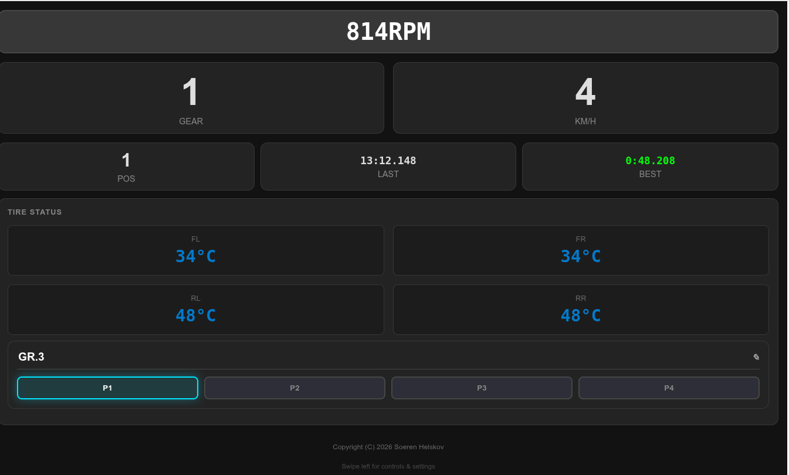
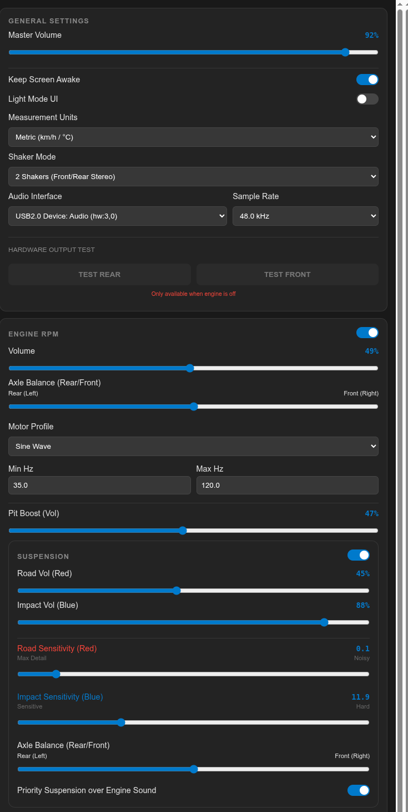
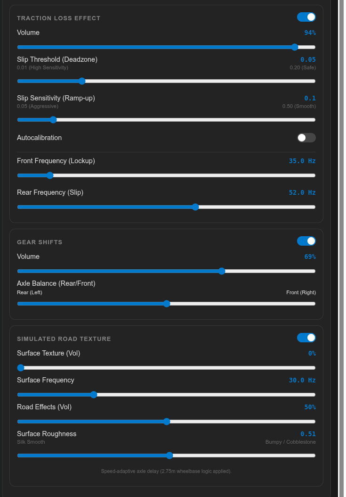

# GT7 Shaker for Linux 1.30
GT7 Shaker for Linux is a Python-based telemetry-to-audio converter specifically designed for Gran Turismo 7. It captures real-time physics data from your PS5 or PS4 over the network and translates it into haptic feedback for Bass Shakers using a standard soundcard or hardware like NobSound amplifiers with builtin soundcar functionality

Project is still under development and bugs is to be expected. 

Project started as personal project as i wanted a solution where is didn't need to boot a windows machine and start software like SimHub and etc. 
I wanted a solution that could run on linux and on lightweight hardware as my Raspberry Pi 3 build right on to my Rig. 

## 🚀 Technical Core Features

Focusing on the engine's "brain" and performance.

Low-Latency DSP Engine: A multi-threaded Python engine designed for high update rates to ensure near-instant haptic feedback.

UDP Telemetry Decryption: Automated handling of the Salsa20-encrypted data stream directly from the PS5 console.

Physics-to-Audio Logic: Advanced algorithms that translate suspension acceleration, tire slip, and engine vibrations into audio signals.

Speed-Adaptive Axle Delay: Intelligent "bump timing" calculation based on the vehicle's wheelbase and current speed (e.g., bumps hit the front shaker first, then the rear).

Cross-Platform Web UI: A responsive Flask-based interface that works seamlessly on desktop and mobile, featuring "Keep Screen Awake" functionality.

Profile Persistence: Save and name up to 4 individual tuning profiles directly to config.json for different car classes or racing styles.





## 🛠 Prerequisites
Hardware
PS4/PS5 running Gran Turismo 7.

Linux PC (or any system running Python) on the same local network as the PS5.

Soundcard connected to an amplifier and haptic transducers (e.g., Buttkicker, Dayton Audio pucks).


## 💻 Installation & Usage


### Recommended: Install via pipx
The easiest way to install and run GT7 Shaker as a standalone application:
    ```bash
    pipx install https://github.com/Helskov/GT7-Shaker-for-linux/releases/download/v1.30/gt7_shaker-1.30-py3-none-any.whl
    
After installation, simply run gt-shaker from anywhere in your terminal.


Option 2: Install from Source (For Developers)
Start by cloning the project to your local machine:

    git clone https://github.com/Helskov/GT7-Shaker-for-linux.git
    cd GT7-Shaker-for-linux

Modern Linux distributions (like Ubuntu 23.04+ or Debian 12+) require Python packages 
to be installed in a virtual environment to protect system stability:
    
    python3 -m venv shaker-venv
    source shaker-venv/bin/activate

You should now see (shaker-venv) in your terminal prompt.
Install the required libraries (Flask, PyAudio, NumPy, etc.) inside your environment:

    pip install -r requirements.txt

Since the project uses relative imports to manage audio and telemetry modules, it must be run as a Python module:

    cd src
    python3 -m gt_shaker.web_app

Access the Dashboard: Open your browser (on PC or Smartphone) and go to http://[YOUR_PC_IP]:5000.

Inbound: Port 33740 (UDP) - Receives telemetry packets from GT7
Outbound: Port 33739 (UDP) - Sends heartbeats to PS5/PS4
Open Port 5000 as well for the browser. 

Connect to GT7: Enter your PS5 IP Address in the connection card and click START ENGINE.

## ⚙️ Interface & Configuration
## 📱 Web Interface & Functionality

The web interface is designed for ease of use and is divided into two main pages. You can navigate between them by **swiping** on mobile devices or **clicking the navigation dots**.
---

### 🏎️ Page 1: Race Dashboard
*Optimized for focus on essential race data.*

* **High-Visibility Telemetry**: Large, clear displays for **RPM**, **Current Gear**, and **Speed (KM/H)** for instant recognition during high-speed maneuvers.
* **Race Position & Timing**: Real-time tracking of your **Current Position (POS)** and precise lap timing, including **Last Lap** and **Best Lap** performance metrics.
* **Live Tire Temperatures**: Individual temperature readouts for all four tires (**FL, FR, RL, RR**) to monitor grip levels and thermal degradation in real-time.
* **On-the-Fly Profile Selection**: Quick-access buttons for **4 Preset Profiles (P1-P4)**, allowing you to switch between custom tuning setups (e.g., "Formel") instantly without leaving the dashboard.

---

### 📊 Page 2: Live Telemetry & Monitoring
*Focuses on real-time data visualization while driving for optimizations.*

* **Engine Control**: Features a dedicated **Start/Stop Engine** button to manually toggle the haptic processing engine.
* **Connection Status**: Includes an **Online (Live)** status indicator that confirms the system is successfully receiving telemetry data from the console.
* **Integrated Help**: A dedicated **Help** button provides immediate access to the manual and setup guides directly from the dashboard.
* **Technical Readouts**: Detailed real-time data for **Gear**, **Speed**, and precise **Tire Temperatures**.
* **Real-time Gauges**: Visual display of **RPM**, **Speed**, **Gear**, and **Pedal** (Throttle/Brake) inputs.
* **Tire Status**: Monitoring of tire temperatures with color-coded alerts for optimal grip management.
* **Pedal Telemetry**: A live bar and graph showing **Throttle (Green)** and **Brake (Red)** input levels.
* **Shaker Signal Analysis**: A multi-channel graph analyzing the live intensity of **Road**, **Impact**, **Traction**, and **Sim-Road** haptic signals.
---

### ⚙️ Page 3: Advanced Shaker Tuning
*This page allows you to customize the physical feel of the haptic feedback in real-time.*

#### 🛠️ General Settings
* **Global Gain**: Precise control over **Master Volume** (0-100%) to scale all active haptic effects.
* **Screen & Theme**: Toggle **Keep Screen Awake** to prevent mobile devices from sleeping during sessions, and switch between **Light/Dark Mode** UI themes.
* **Hardware Configuration**: Select your preferred **Measurement Units** (Metric vs. Imperial) and configure your **Shaker Mode** (e.g., Front/Rear Stereo).
* **Audio Engine**: Select the specific **Audio Interface** (soundcard/USB) and set the **Sample Rate** (44.1 kHz or 48.0 kHz) for optimal compatibility.
* **Hardware Output Test**: Dedicated buttons to **Test Rear** and **Test Front** channels (active when engine is off) to verify shaker wiring.

#### 🏎️ Engine RPM
* **Custom Profiles**: Toggle between **Sine Wave** and other profiles, with independent **Volume** and **Axle Balance** (Rear/Front) controls.
* **Frequency Tuning**: Manually define **Min Hz** and **Max Hz** to match your transducers' resonance range.
* **Pit Boost**: Independent volume control for engine vibrations while the car is stationary.

#### 🛣️ Suspension
* **Dual-Channel Feedback**: Independent sliders for **Road Vol (Red)** and **Impact Vol (Blue)**.
* **Sensitivity Control**: Fine-tune the **Road Sensitivity** and **Impact Sensitivity** to filter out noise or emphasize heavy hits.
* **Priority Logic**: Toggle **Priority Suspension over Engine Sound** to automatically dim RPM vibrations during heavy suspension travel for maximum clarity.

#### 🏁 Traction & Grip
* **Interface**: Dedicated sliders for **Sensitivity** and **Volume control**.
* **Auto-calibration**: Toggle functionality to ensure the traction loss effect remains accurate across different car classes.

#### 🕹️ Gear Shift Feedback
* Shift Intensity: Dedicated Volume slider for the mechanical gear-change "thump."
* Axle Balance: Move the gear shift sensation between Rear and Front transducers to match your rig's physical layout.

🏗️ Simulated Road Texture
* Haptic Surface: Adjustable Surface Texture and Road Effects volume for artificial road vibration.
* Roughness Tuning: Slider to change the road feel from Silk Smooth to Bumpy / Cobblestone.
* Wheelbase Logic: Advanced Speed-adaptive axle delay (e.g., 2.75m wheelbase logic) that ensures bumps hit the front and rear shakers at the correct timing based on vehicle speed.
---

<table>
<tr>
<td><b>Page 1: Telemetry</b></td>
<td><b>Page 2: Shaker Tuning</b></td>
</tr>
<tr>
<td></td>
<td></td>
</tr>
</table>

## 🗺️ Roadmap & Future Plans
The project is under active development. Below are the planned features and current "to-do" items:

* More stability to the engine. See outstanding. 

* Cleanup and see if i can make the code more effective. 

* Maybe and just maybe support for motion. The integration should not be hard. But i have nothing to test with. 

* Landscape Mode Optimization: Specific CSS layouts for horizontal viewing on mounted devices.

* Multi-Channel Support: Expand from 2-channel stereo to 4.0 or 5.1 surround sound for 4-corner setups.

## 🛠️ In Progress / Outstanding

* Fix you sometimes have to restart engine when track changes or engine was already on when you started the game. 

## 🚀 Future Features (Planned)

* Support for Wind simulator

## Changes

### v1.30
* **Increased robustness**: he software now automatically detects and recovers the connection after PS5 sleep mode or long idle periods in menus. No need to manually Stop/Start the engine    anymore – it is now designed for continuous "set-and-forget" operation.

### v1.29
* **Massive Performance Boost**: Implemented JIT (Just-In-Time) compilation, making audio and physics calculations up to 10x faster while lowering CPU usage.
* **Enhanced Precision**: Refined suspension and tire-slip logic for more detailed and "snappy" haptic feedback.
* **Modular Architecture**: Separated hardware testing from the main engine for a cleaner codebase.
* **Memory Optimization**: Pre-allocated data buffers to reduce background "noise" and stuttering.
* **Bug Fixes**: Resolved an issue where settings could be saved as text instead of numbers, causing crashes.

### v1.28
* **Added Profiles**: Users can now save and name up to 4 different profiles.
* **Persistence**: All settings are now saved to `config.json`.
* **Haptic Improvement**: Road surface texture changed to a more haptic range (20-80Hz).
* **Traction Loss Priority**: Function added to prioritize traction loss over suspension and engine RPM.
* **Custom Headroom**: User-defined headroom for Safe-Gain (40-70%).
* **PWA Optimization**: Improved user manual for Android and iPhone.
* **Default Settings**: Updated defaults to provide a better "out of the box" experience.
* **Traction Calibration**: Faster auto-calibration that works during races; triggers when lifting gas while driving straight.

### v1.27
* **Audio Mixing**: Pit boost volume is now decoupled from Engine RPM volume.
* **Stability**: Fixed "stuck" engine effect after leaving track and prevented crashes when starting the engine without data.
* **Volume Adjustments**: Changed max volume for Gear Shift and Pit Boost.
* **Enhanced Status**: Implemented a more robust 3-stage status system.
* **Race Dashboard**: Added Position, Best Lap, and Last Lap; UI now defaults to Page 2.
* **Analysis**: Shaker analysis now includes traction and road simulation.
* **Removed**: Tire wear functionality (did not work properly).

### v1.26
* **Visuals**: Fixed graphs for throttle, brake, and suspension analysis.

### v1.25
* **Engine Effect**: More aggressive engine effect that follows RPM faster (previously felt like an old-school automatic).
* **Pit Boost UI**: New interface to control engine volume while stationary.
* **ALSA Support**: Prevented ALSA locks during engine start/stop on Linux.
* **Simulated Road Effect**: 
* New file: `Simulated_Road.py`.
* Roughness handle for bumps.
* Speed-based timing: Bumps hit front shakers then rear (reversed in reverse gear).
* **UI/UX**: 
* Start/Stop button stays in sync across multiple browsers.
* Added "Keep Screen On" functionality for mobile phones.
* New Race Dashboard focusing on race-critical data.
* **Traction Control**: Added frequency sliders for front and rear axles and replaced the traction readout.
* **Audio Settings**: Users can now toggle between 44.1kHz and 48kHz.
* **General**: Various bug fixes and stability optimizations.
  you lift the gas and drive straight if enabled. 

## 📂 Project Structure
To run the application correctly, the files must be organized as follows:
```
.
├── .gitignore # Files to be ignored by Git
├── LICENSE # Project license
├── pyproject.toml # Build configuration for the Python package
├── README.md # Documentation and instructions
├── requirements.txt # List of required libraries
└── src/ # Source code directory
    ├── config.json # User settings (auto-generated)
    └── gt_shaker/ # The main program package
        ├── __init__.py # Marks the directory as a package
        ├── audio_processor.py # Audio logic and effects
        ├── main.py # Main engine and audio stream
        ├── network_manager.py # PS5 network communication
        ├── Simulated_Road.py # Road simulation
        ├── tire_processor.py # Tire and traction logic
        ├── web_app.py # Flask web server and dashboard
        ├── assets/ # Images for UI and README
        └── templates/ # HTML files for the dashboard
            ├── index.html
            └── manual.html
